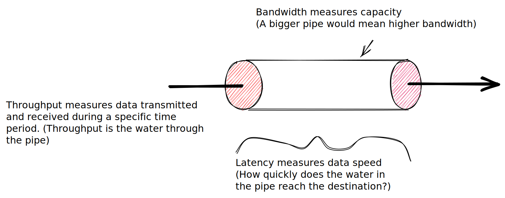

# System Design & Architecture notes.

## Useful links
* [System design primer](https://github.com/donnemartin/system-design-primer)

## CAP Theorem.

Also known as Brewer's theorem. It states that any distributed data store can only
provide two of the following three gurantees:
* Consistency
Every read receives the most recent write or an error.

* Availability
Every request receives a (non-error) respose, without the gurantee that it contains
the most recent write.

* Partition tolerance
The system continues to operate despite an arbitar number of messages being dropped
(or delayed) by the network between nodes.

## Understanding Latency versus Throughput.

Latency: is the time required to perform some action or to produce some result.
         Latency is measured in units of time - hours, minutes, seconds, etc.

Throughput: is the number of such actions executed or results produced per unit
         of time. This is measured in units of whatever is being produced.

A simple example
An assembly line is manufacturing cars. It takes eight hours to manufacture a car
and the factory produces one hundred and twenty cars per day.
The latency is: 8 hours.
The throughput is: 120 cars / day or 5 cars / hour.

**In networking world**
**Throughput** refers to the actual amount of data  transmitted and received during
               a specific time period. Normal unit of measure is bits per second (bps)

**Bandwidth** refers to the amount of data that can be transmitted during a specific
              period of time. Bandwidth measures capacity not speed.

**Latency** measures delay. Delay is simply the time taken for a data packet to reach
            it’s destination after being sent. We measure n/w latency as round trips.

**Latency and Response Time**
Response time is what the client sees: besides the actual time to process the request
(the service time), it includes network delays and queuing delays. Latency is the
duration that a request is waiting to be handled - during which it is latent, awaiting
service.

## Head of line blocking.
Queueing delays often account for a large part of the response time at high
percentiles. As a server can only process a small number of things in parallel,
it only takes a small number of slow requests to hold up the processing of
subsequent requests - effect known as head-of-line blocking.

## Reliability, Scalability, Maintainability:

